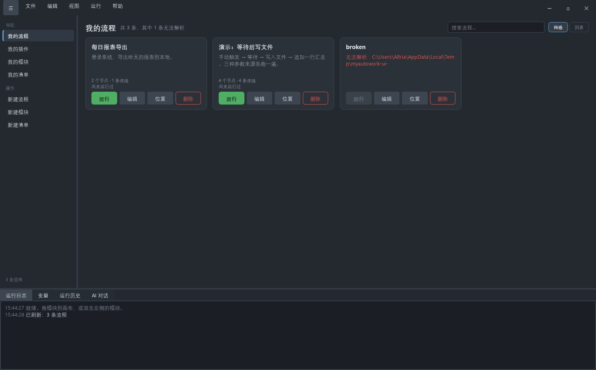

# MyAutoWork

以插件为核心的 Windows 自动化工具。



---

## 为什么做这个

将自动化能力拆解为独立的模块。针对不同软件，可编写专门的模块实现自动化逻辑。

模块开发仅需遵循统一规范，由内核负责串联调度，保障各模块协同运行。

用户可如同搭积木一般，自由组合模块，搭建所需的自动化业务流程。

---

## 快速开始

需要 **Windows** 和 **Python 3.10+**（[下载](https://www.python.org/downloads/)，安装时记得勾上 *Add Python to PATH*）。

```bat
git clone https://github.com/Altriazyk/MyAutoWork.git
cd MyAutoWork
py -m venv .venv
.venv\Scripts\pip install -e ".[ui]"
.venv\Scripts\python -m host.app
```

第一次会下载 PySide6（几十兆）。

## 深入

设计上的取舍、架构、怎么自己写插件，都在 [`docs/DESIGN.md`](docs/DESIGN.md)。

## 许可

[MIT](LICENSE)
